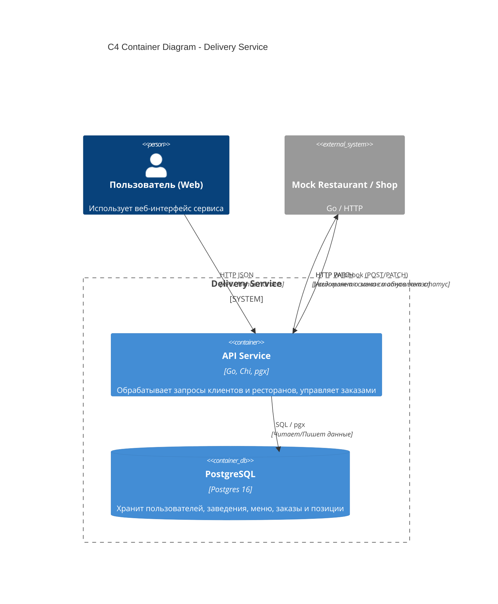
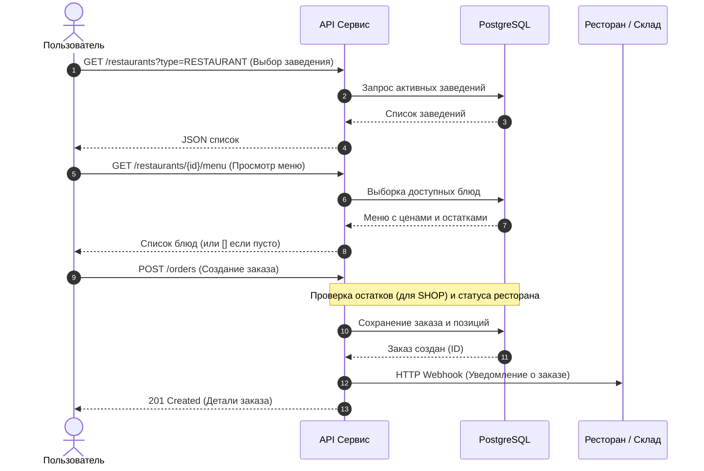
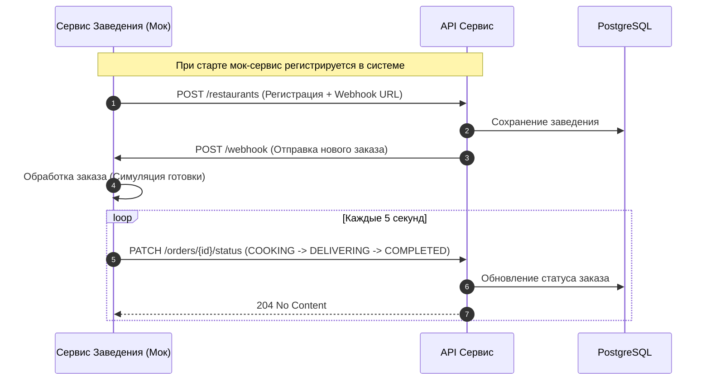

# Delivery Service — MVP Сервиса Доставки Еды

Бэкенд-сервис доставки еды, реализующий интеграцию с партнерскими заведениями (рестораны и магазины) и обработку заказов пользователей.

---

## 🚀 Быстрый старт (Запуск)

Проект полностью упакован в Docker Compose и поднимается одной командой:
```bash
docker compose up --build -d
```

После запуска будут доступны:
* Основной API: `http://localhost:8080/api/v1`
* Мок-ресторан (интеграционный сервис): `http://localhost:8081`
* База данных PostgreSQL: `localhost:5432`

## 🏛️ Архитектура (C4 Diagram - Level 2)

Ниже представлена схема контейнеров системы, демонстрирующая взаимодействие клиента, основного API, базы данных и внешнего сервиса заведения.



## 🛒 Customer Journey Map (CJM)

### 1. Пользовательский сценарий (Покупка еды/товаров)



### 2. Сценарий со стороны заведения



## 🗄️ Схема Базы данных и Миграции

Структура базы данных спроектирована с учетом масштабирования после завершения MVP. Инициализация и миграции выполняются автоматически через утилиту `Goose` при старте контейнеров.

* `users` — список пользователей платформы.
* `restaurants` — заведения и магазины (поля: `type` (RESTAURANT/SHOP), `is_active`, `webhook_url`).
* `menu_items` — меню заведений (поля: `price`, `stock_quantity` для контроля остатков магазинов, `is_available`).
* `orders` — заказы пользователей (поля: `status`, `delivery_address`, `total_price`).
* `order_items` — состав заказа (связь многие-к-многим между заказом и меню).

## 📝 Дополнительная документация и Качество кода

* **OpenAPI Спецификация:** Полное описание эндпоинтов и кодов ошибок находится в файле `openapi.yaml` в корне репозитория.
* **Статический анализ (Линтер):** Проект проверяется с помощью `golangci-lint`. Конфигурация находится в файле `.golangci.yml`.

## Тестирование

В проекте реализовано три уровня тестирования: юнит-тесты для репозиториев и сервисов, а также сквозные E2E-тесты.

### 1. Юнит-тесты (Репозитории и базы данных)
Для запуска тестов репозиториев используется изолированное тестовое окружение. Поднимите только тестовую базу данных:
```bash
docker compose -f docker-compose.e2e.yaml up db_e2e migrator_e2e -d
```

Запустите тесты:

```bash
go test -v ./internal/repository/postgres/...
```

### 2. Юнит-тесты (Сервисный слой)

Тестирование бизнес-логики с помощью моков (не требует запущенной базы данных):

```bash
go test -v ./internal/service/...
```

### 3. E2E (End-to-End) тесты

E2E тесты проверяют работу всего приложения целиком (HTTP API, базу данных, миграции и интеграцию со слоями).

1. Поднимите полное E2E окружение (API, базу данных, мигратор и мок-ресторан):

```bash
docker compose -f docker-compose.e2e.yaml --env-file .env.e2e up --build -d
```

2. Запустите E2E тесты:

```bash
go test -v ./e2e/...
```

## 💡 Допущения и упрощения (MVP)

* **Аутентификация:** Согласно ТЗ, авторизация пользователей и заведений в рамках MVP не реализовывалась.
* **Управление транзакциями:** Списание остатков для магазинов (SHOP) и создание заказа объединены на уровне сервисного слоя для обеспечения атомарности.
